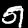

# Tagger: Deep Unsupervised Perceptual Grouping
A Tensorflow implementation of Tagger framework with all codes in a single file called tagger.py 
## Environment: 
Tensorflow 1.13.1, Python3.7

## Experiment: 
For this experiment, two images randomly chosen from the MINST dataset were shifted, rotated, and then stacked together to produce an input for the framework. The whole training process took about an hour on my mechine, which has an rtx2080ti GPU and 32G RAM, but the GPU utilization was low(it might because the network have some recursive structures). 
## Results:
### First group:

### Second group:

## Reference:
* Klaus Greff, Antti Rasmus, Mathias Berglund, Tele Hotloo Hao, Jürgen Schmidhuber, Harri Valpola: “Tagger: Deep Unsupervised Perceptual Grouping”, 2016; [http://arxiv.org/abs/1606.06724 arXiv:1606.06724].
